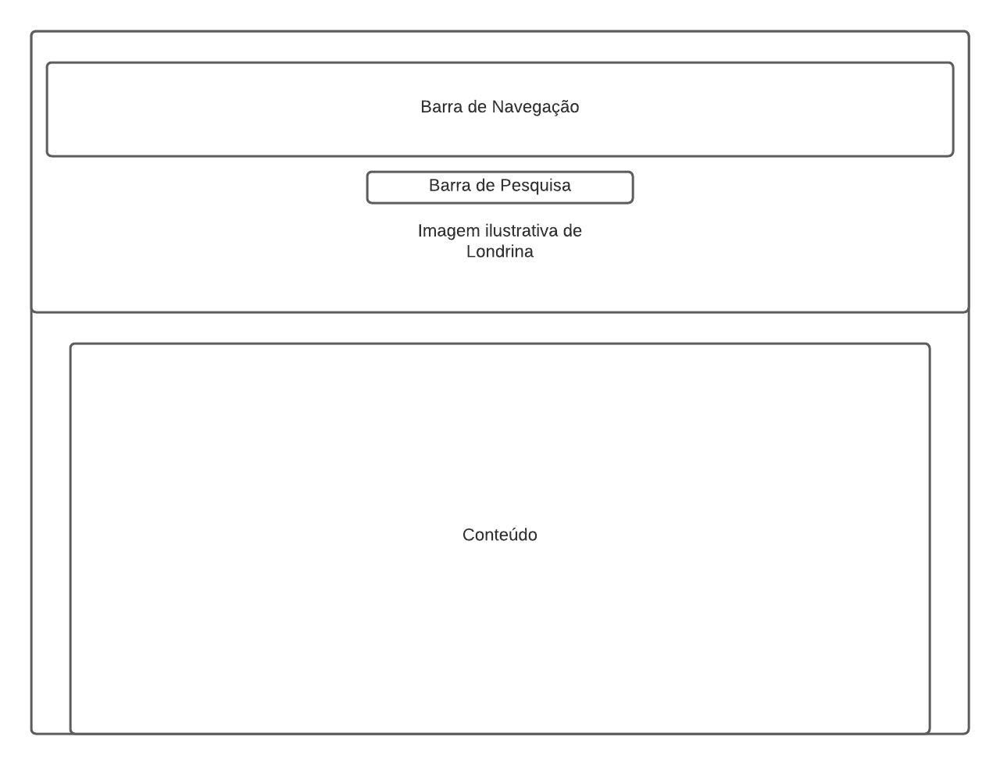

# Guia de Estilo

## 1. Introdução

### 1.1. Objetivo do guia de estilo

Guia de estilo como o nome se propõe serve como guia para a equipe de design e a equipe de desenvolvimento para registrar as principais decisões tornando-as de fácil consulta e utilização por todas as equipes. Com isso mantém-se o padrão de design em extensões e futuras versões do produto (Barbosa e Silva, 2010). Entre os objetivos do guia de estilo estão: servir como uma ferramenta de comunicação entre os membros da equipe de design e também com a equipe de desenvolvimento; e servir como uma base de consulta para que importante decisões de design possam ser facilmente reutilizadas nas discussões sobre versões futuras do produto.

No escopo do trabalho, a equipe usará o guia de estilo com o objetivo de servir como um guia para a criação dos protótipos de média e alta fidelidade do site Vjudge, ao longo do processo de desenvolvimento do projeto.

### 1.2. Organização e conteúdo do guia de estilo

A organização do guia de estilo será definido a partir do livro Interação Humano Computador da autora Simone Barbosa e será orientado a partir do ciclo de vida Mayhew, o qual sugere que o guia de estilo tem que ser seguido ou modificado a cada nível de prototipagem.

### 1.3. Público-alvo do guia de estilos

O público alvo deste guia são os membros da nossa equipe que desejam realizar correções nos elementos problemáticos identificados.

### 1.4. Como utilizar o guia (em produção e manutenção)

Este guia servirá como base para a elaboração do protótipo de melhoria do site e a cada etapa dentro do ciclo de Mayhew deve-se aplicar o guia de estilo ao projeto.

### 1.5. Como manter o guia

Como sugerido por Mayhew o guia deve ser atualizado ao final de cada fase, tornando-se assim possível a sua evolução no decorrer do projeto.

## 2. Resultados e análise

### 2.1 Descrição do ambiente de acesso dos usuários

Por ser uma página de prefeitura, que contém informações que podem vir a ser úteis para as pessoas da cidade. O ambiente de acesso dos usuários pode ser dos mais variados, desde computadores de última geração com a maior resolução possível à celulares muito antigos com as telas muito pequenas. Além da grande variedade de aparelhos, também não há garantia de que o usuário acessará o site em um local com poucos ruídos. Logo, há uma necessidade ainda maior que o normal de uma aplicação de fácil uso.

## 3. Elementos de interface

### 3.1. Disposição espacial e grid

A disposição do layout do site se dá de maneira bagunçada e poluida por excesso de informações, alguns botões não
levam o usuário ao local devido deixando a navegação cansativa e frustante para os usuários.

As janelas de noticia seguem um padrão confuso e ruim deixando fraca a navegação do site comprometida, para solucionar esse problema foi desenvolvido um grid para ser um padrão melhorado pois além de mostrar a noticia selecionada o protótipo mostra outras notícias fazendo com que os usuários se mantenham no site. Segue abaixo o protótipo elaborado:

<figure>
    
    <figcaption>Figura 1 - Layout e grid</figcaption>
</figure>

### 3.2 Janelas

Os protótipos possuirão as mesmas janelas do site original, porém faremos uma disposição diferente para atender às necessidades dos usuários como descrito no tópico 2.1.

### 3.3. Tipografia

A fonte a ser utilizada por nós será a <a href="https://fonts.google.com/specimen/Poppins?preview.text_type=custom" target="_blank">Poppins</a>, projetado por Ninad Kale e Jonny Pinhorn, e a fonte <a href="https://fonts.googleapis.com/css2?family=Roboto:wght@100&display=swap" target="_blank">Roboto</a>

### 3.4 Símbolos não tipográficos

<table>
    <tr>
        <td colspan=4>Ícones</td>
    </tr>
    <tr>
        <td></td>
        <td></td>
        <td></td>
        <td></td>
    </tr>
    <tr>
        <td></td>
        <td></td>
        <td></td>
        <td></td>
    </tr>
    <tr>
        <td></td>
        <td></td>
        <td></td>
        <td></td>
    </tr>
</table>
<figcaption>Tabela 1 - Ícones</figcaption>

### 3.5. Cores

#### 3.5.1 Cores Principais

As cores base do site estão selecionadas e mostradas na imagem do tópico de **simbolos** logo acima, sendo elas:
<ul>
    <li><b>Azul</b></li>
    <li><b>Branco</b></li>
    <li><b>Cinza</b></li>
    <li><b>Vermelho</b></li>
    <li><b>Verde</b></li>
</ul>

Tendo como base as tonalidades encontradas no símbolo da Câmara Municipal de Londrina e da Bandeira de Londrina

<figure>
    
    <figcaption>Figura 2 - Bandeira de Londrina</figcaption>
</figure>

<figure>
    
    <figcaption>Figura 3 - Brasão de Londrina</figcaption>
</figure>

### 3.6. Animações

Nossos protótipos não terão animações, pois não convém fazê-las, já que pretendemos manter o site simples e objetivo.

## 4. Elementos de interação

### 4.1. Estilos de interação

Estilos de interação utilizados no site:
<ul>
    <li>Menus: possibilitando navegação do usuário pelo site;</li>
    <li>Linguagem natural: situando o usuário e o que pode fazer;</li>
    <li>WIMP: <b>W</b>indow <b>I</b>con <b>M</b>enu <b>P</b>oint device, utilização de ícones e menus;</li>
</ul>

### 4.2. Seleção de um estilo

O estilo de utilização mais presente no site é o de menus em conjunto com os ícones.

### 4.3. Aceleradores (teclas de atalho)

Não foi encontrado nenhum mecanismo facilitador no uso do site.

## 5 Elementos de ação

### 5.1. Preenchimento de campos

Todos os campos de preenchimento devem ser preenchidos manualmente pelo usuário seguindo suas necessidades.

### 5.2. Seleção

O usuário tem liberdade para fazer quaisquer seleções desejadas dentro do site, portanto nao há necessidade de bloqueio da seleção.

### 5.3. Ativação

Seguindo os fundamentos de usabilidade, uma vez dentro do site o usuário tem total liberdade.

## 6. Vocabulário e padrões

### 6.1. Terminologia

A linguagem utilizada é em sua maior parte de fácil entendimento, porém existem termos técnicos, administrativos e jurídicos específicos da administração pública que não podem ser alterados.

### 6.2. Tipos de tela (para tarefas comuns)

O site utiliza da tela padrão na maior parte de suas páginas o que dá ao usuário mais conforto e facilidade de aprendizado e interação, porém isso não ocorre na área de imprensa onde é mantido apenas a navbar e o cabeçalho padrão.

### 6.3. Sequências de diálogos (e.g., para feedback ou confirmação de uma operação)

Não existe nenhuma sequência de diálogos no sistema ou a necessidade de confirmar qualquer ação.

## Referências bibliográficas

> Barbosa, S. D. J.; Silva, B. S. da; Silveira, M. S.; Gasparini, I.; Darin, T.; Barbosa, G. D. J. (2021) Interação Humano-Computador e Experiência do usuário. Autopublicação.

## Versionamento

| Versão | Data       | Modificação                                                               | Autor                     |
| ------ | ---------- | ------------------------------------------------------------------------- | ------------------------- |
| 0.1    | 02/09/2021 | Escrita do tópico de introdução                                           | Vitor Diniz e Rafael Leão |
| 0.2    | 02/09/2021 | Escrita do tópico de resultados da análise                                | Vitor Diniz e Rafael Leão |
| 0.3    | 02/09/2021 | Desenvolvimento do tópico de elementos de interface                       | Vitor Diniz e Rafael Leão |
| 0.4    | 02/09/2021 | Desenvolvimento dos tópicos de elementos de interação e elementos de ação | Vitor Diniz e Rafael Leão |
| 0.5    | 02/09/2021 | Elaboração do tópico de Vocabulário e padrões                             | Vitor Diniz e Rafael Leão |
| 0.6    | 02/09/2021 | Adicionando referências bibliográficas                                    | Vitor Diniz e Rafael Leão |
| 1.0    | 02/09/2021 | Finalizando Documento de Guia de Estilo                                   | Vitor Diniz e Rafael Leão |
