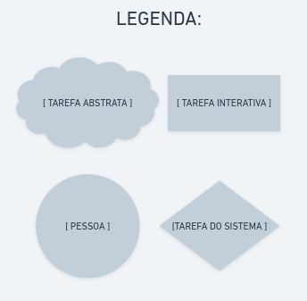
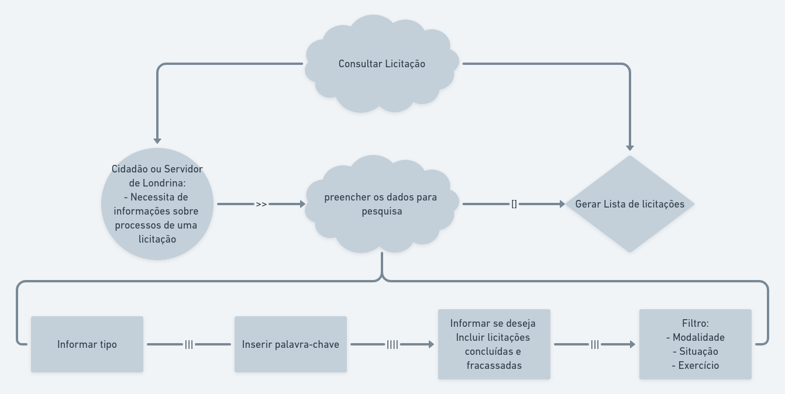
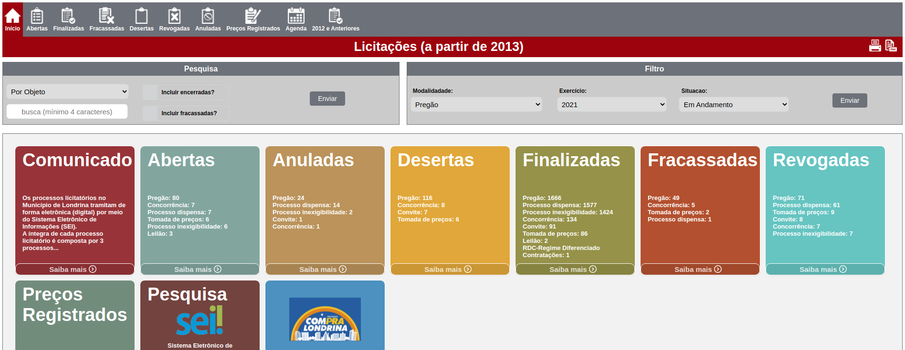
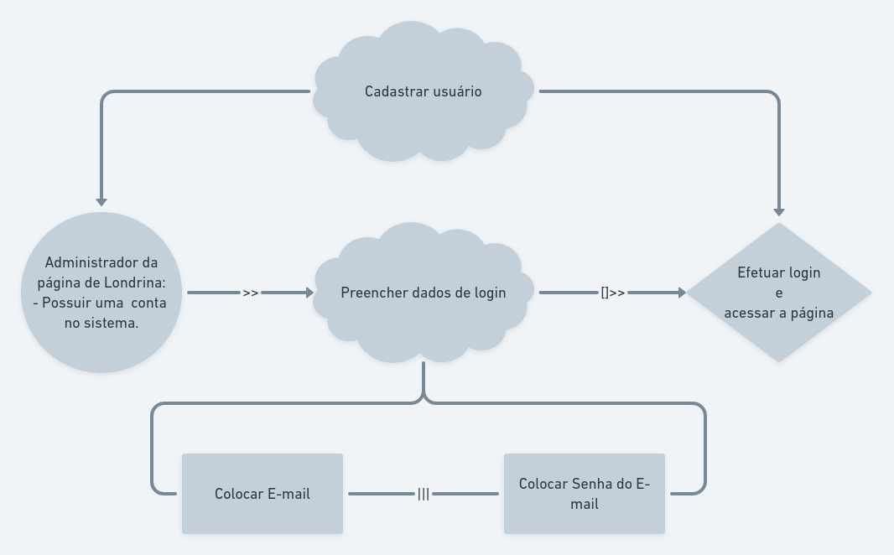
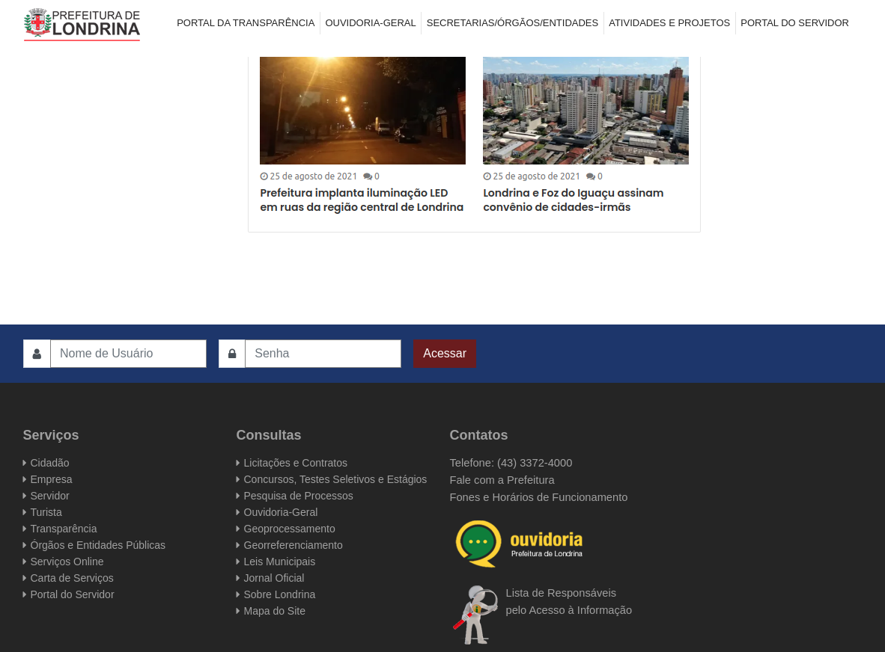

# Árvore de Tarefas Concorrentes - CTT(ConcurTaskTrees)

## 1 - Introdução

Para auxiliar no design e na avaliação de IHC, usamos o modelo de árvores de tarefa concorrentes. O CTT permite representar diversas relações entre as tarefas através gráficos e ilustrações que tornam mais claros o fluxo de tarefas. Os quatro tipos de tarefas são:

* Tarefas do usuário, realizadas fora do sistema;
* tarefas do sistema, em que o sistema realiza um processamento sem interagir com o usuário;
* Tarefas interativas, em que ocorrem os diálogos usuário–sistema;
* Tarefas abstratas, que não são tarefas em si, mas sim uma representação de uma composição de
tarefas que auxilie a decomposição;

## 2 - Elaboração

O Portal da Transparência da Prefeitura de Londrina é um ambiente criado para facilitar o acesso às informações da Prefeitura pelo cidadão.

Considerando a Lei de Acesso à Informação (Lei 12.527, de 18/11/2011) e a Lei Complementar 131, de 27/05/2009,  o Portal da Prefeitura de Londrina busca a cada dia praticar a cultura da transparência e do controle social no Município de Londrina.

* **Perfil**
    
Cidadão da cidade de Londrina e precisa de informações seguras e relevantes

* **Persona**
    - Administrador do site
    - cidadão comum de Londrina com baixo nível de permissão dentro do sistema.

## 3 - Cenário das Tarefas

Para criar a árvore de tarefas, defimos quais funções abrigam nosso sistema e então separamos entre os quatro tipos de tarefa.

O site da prefeitura de Londrina Possui as seguintes tarefas:

* Tarefas de usuário:
  * Buscar informação de Londrina
  
* Tarefa do sistema:
  * Hospedar dados informativos e disponibilizar via WEB e mobile.

* Tarefas Interativas
  * Usuário comum:
    * preencher campos de pesquisa e filtro
    * Informar dados de login (somente para usuário administradores)

* Tarefas abstratas
  * Consultar Agendamento eletrônico
  * Encontrar Assistência Social
  * Consultar Alvará de Licensa de Localização
  * Consultar Carta de Serviços
  * Consultar Certidões
  * Consultar agenda cultural
  * Consultar vagas para emprego
  * Consultar informações geográficas de Londrina
  * Consultar notícias de Londrina
  * Consultar Notas fiscais de Londrina
  * Consultar obras em andamento

## 4 - Diagramas das árvores de tarefas concorrentes

    Figura 1 - Legenda das tarefas que serão dispostas no CTT

    Figura 2 - CTT da consulta do usuário

    Figura 3 - página de consulta de licitação.

    Figura 4 - CTT do login de super usuário.

    Figura 5 - página para super usuário logar.

# Referência

Livro - Barbosa, S. D. J.; Silva, B. S. da; Silveira, M. S.; Gasparini, I.; Darin, T.; Barbosa, G. D. J. (2021) Interação Humano-Computador e Experiência do usuário. Autopublicação.

# Versionamento

| Versão | Data | Modificação | Autor |
| :---: |:---: | :---: | :---: |
|  1.0  | 25/08/2021 | Criação do CTT | Victor Yukio |
|  1.1  | 27/08/2021 | Revisando o documento | Abner Filipe |
