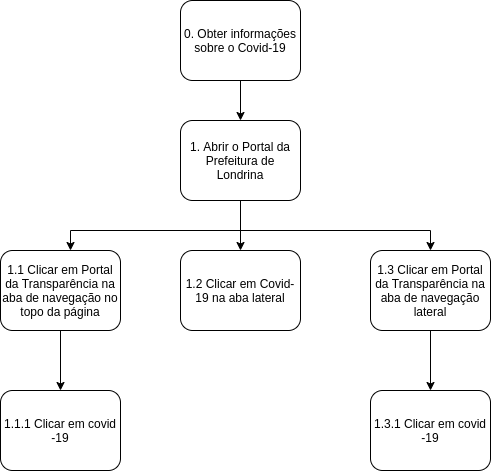

# HTA

## Introdução

A análise de tarefas busca compreender o trabalho dos usuários, colocando em perspectiva como ele é realizado e por que ele é realizado. Pode ser utilizada em diversos momentos do desenvolvimento como por exemplo a análise da situação atual.

## Análise Hierárquica de Tarefas (HTA)

 A análise Hierárquica de tarefas analisa os objetivos de alto nível e os decompões em subobjetivos que são alcançados por operações, a unidade fundamental do HTA.

* Uma **tarefa** é definida como qualquer parte do trabalho a ser realizado.
* Um **objetivo** é um estado final.
* Um **plano** define os subobjetivos necessários para alcançar um outro objetivo maior, a ordem em que esses subobjetivos devem ser alcançados.
* Uma **operação** é especificada pelas circunstâncias nas quais o objetivo é ativado(_input_ ou _entrada_), pelas atividades ou ações (_actions_) que contribuem para atingi-lo e pelas condições que indicam o seu atingimento (_feedback_).
*  Uma **ação** pode ser entendida como uma instrução para fazer algo sob certas circunstâncias, o _**input**_ como estados e o _**feedback**_ como testes ou avaliação do estado final.

##  Análise da tarefa de acesso às informações do covid-19

#### Referências

  <ul>  
    <li>Livro: BARBOSA, S. D. J.; SILVA, B. S. Interação Humano-Computador. 1ª edição, Rio de Janeiro: Elsevier, 2010.</li>
  </ul>

## Versionamento
|Versão|Data|Modificação|Autor|
|:--:|:--:|:--:|:--:|
|1.0|27/08/2021|Criação do diagrama HTA.|Victor Lima|
|1.1|27/08/2021|Criação do documento com diagrama e descrição.|Victor Lima|
