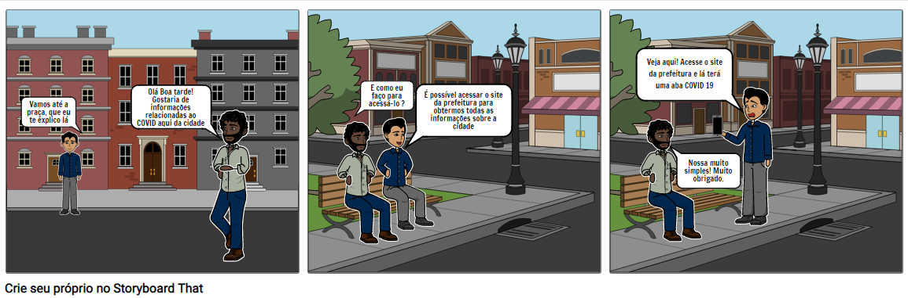
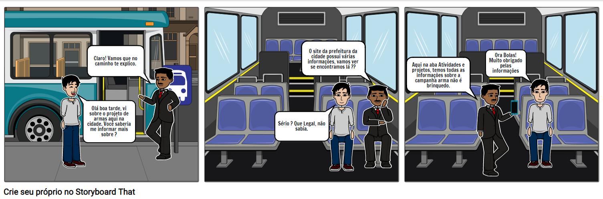
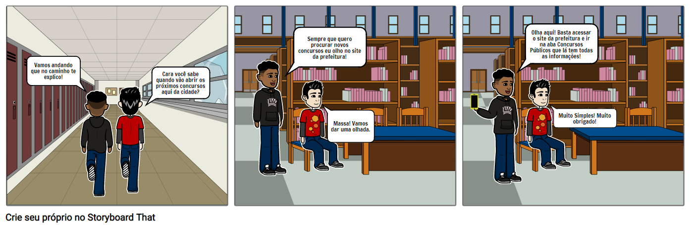

## Introdução

Storyboard se trata de um recurso que prototipa com baixa fidelidade o funcionamento do sistema em desenvolvimento. Trabalha juntamente com ele o recurso de criação de cenários da utilização desse sistema, onde uma sequência de esboços representa a evolução de uma tarefa dentro do sistema.

## Objetivo

O storyboard faz com que algumas atividades sejam melhor detalhadas e demonstradas de forma mais intuitiva para as partes interessadas.

## Storyboards

    A intenção dos storyboards abaixo é mostrar como o portal da Prefeitura de Londrina possui as informações que os moradores precisam e como acessá-las de forma mais simples.

## Storyboard 1

O storyboard abaixo mostra uma situação em que o morador necessita saber as informações do covid-19 na cidade.

 
    </img>
    

    <figcaption>Figura 1.1 - Situação em que um morador deseja obter informações sobre a Covid-19 na cidade</figcaption>
    

## Storyboard 2

O storyboard abaixo relata um cenário em que o morador deseja saber sobre o projeto de armas da cidade de Londrina.

 
    </img>
    

    <figcaption>Figura 2.1 - Situação em que o morador deseja saber informações sobre a campanha de armas na cidade de Londrina</figcaption>
    

## Storyboard 3

O storyboard abaixo relata um cenário em que um estudante deseja saber informações de concursos que serão realizados em Londrina no período atual.

 
    </img>
    

    <figcaption>Figura 3 - Situação em que o morador deseja saber quais concursos públicos estão acontecendo na cidades</figcaption>
    

## Referências bibliográficas

> Barbosa, S. D. J.; Silva, B. S. da; Silveira, M. S.; Gasparini, I.; Darin, T.; Barbosa, G. D. J. (2021) Interação Humano-Computador e Experiência do usuário. Autopublicação.

> “Design de Interação: Além da Interação Humano-Computador eBook: Rogers, Yvonne, Sharp, Helen, Preece, Jenny: Amazon.com.br: Loja Kindle”, [s.d.]

## Versionamento

| Versão | Data| Modificação|Autor|
| :--: | :--: | :--: | :--:|
| 1.0    | 12/09/2021 | Criação dos storyboards | Victor Lima e Abner Filipe |
| 1.1    | 12/09/2021 | Criação do documento | Victor Lima e Abner Filipe |