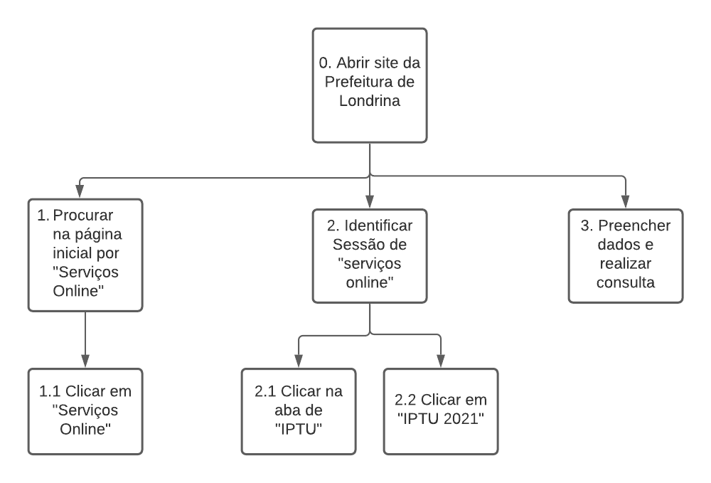
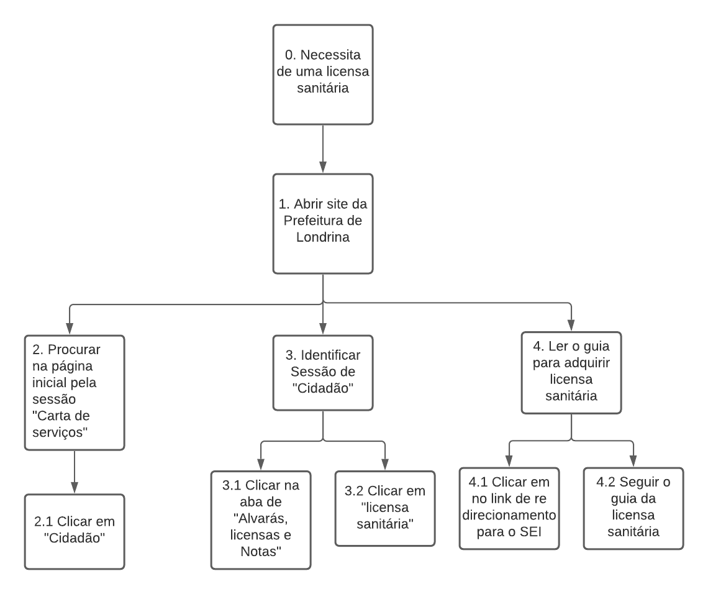
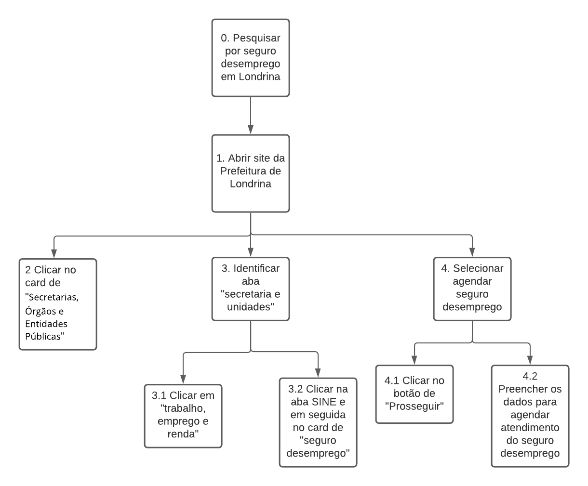

# Avaliação de tarefas
 
## Introdução

Para ter um entendimento melhor sobre o papel dos usuários para verificar como eles realizam as atividades e porque a realizam. Esse documento tem como objetivo analisar e documentar os dados coletados dessas tarefas.

 
## Preparação

As atividades selecionadas para a avaliação foram:

* Consultar IPTU;
* Lincensa Sanitária;
* Agendamento Seguro Desemprego;
 
### Método de avaliação

O método escolhido para avaliar as atividades foi o percurso cognitivo. O percurso cognitivo é um método de avaliação por inspeção cujo principal objetivo é avaliar a facilidade de aprendizado de um sistema interativo. O método conceitua as tarefas usando pela primeira vez também chamado de "aprender fazendo".
 
Os perfis de usuários foram definidos e identificados no planejamento e na entrevista realizada.

 
## Objetivos e Coleta de dados
 
### Consultar IPTU
 

 
    </img>
    

    <figcaption>Figura 1 - Diagrama do fluxo de consultar IPTU.</figcaption>
    

 
### Especificação
 
| Operações | Problemas e recomendações |
|:---:|:---:|
| 0. Abrir site da prefeitura de Londrina | |
| 1. Procurar na página inicial por "serviços online" | **Problema:** Tela inicial Poluída, com muita informação. **Recomendação:** Diminuir o número de interações e link de navegação  |
| 1.1 Clicar em "Serviços Online" |  |
| 2. Identificar sessão de "Serviço Online" |  |
| 2.1 Clicar na aba de "IPTU" | **Problema:** Cores claras dificultam a visualização **Recomendação:** Colocar cores mais escuras |
| 2.2 Clicar em "IPTU 2021" |  |
| 3. Preencher dados e realizar consulta | **Problema:** falta de alerta quando não preenche um dos campos de pesquisa. **Recomendação:** Criar alertas ou avisos para melhorar a usabilidade. |
 
### Licença Sanitária
 

</img>

   Figura 1 - Diagrama do fluxo de adquirir licença sanitária.

 
### Especificação
 
| Operações | Problemas e recomendações |
|:---:|:---:|
| 0. Necessita de uma licença sanitária | |
| 1. Abrir site da prefeitura de Londrina | |
| 2. Procurar na página inicial pela sessão "carta de serviços" | **Problema:** Tela inicial Poluída, com muita informação. **Recomendação:** Diminuir o número de interações e link de navegação |
| 2.1 Clicar em "cidadão |  |
| 3. Identificar sessão de "Cidadão" |  |
| 3.1 Clicar na aba de "Alvarás, licenças e Notas |  |
| 3.2 Clicar em "licença sanitária" | **Problema:** muitos campos na aba. **Recomendação:** Criar campos mais abrangentes que reduza o número de opções |
| 4. Ler o guia para adquirir licença sanitária | **Problema:** O guia oferece poucos recursos para auxiliar o usuário. **Recomendação:** Melhorar e atualizar o guia de licença sanitária. |
| 4.1 Clicar no link de re-direcionamento para o SEI | **Problema:** O link re-direciona para outro site. **Recomendação:** integrar o site da prefeitura com a aquisição da licença sanitária.  |
| 4.2 Seguir o guia de licença sanitária |  |
 
### Agendamento Seguro Desemprego
 

   Figura 1 - Diagrama do fluxo informações para seguro desemprego.

 
### Especificação
 
| Operações | Problemas e recomendações |
|:---:|:---:|
| 0. Pesquisar por seguro desemprego em Londrina | |
| 1. Abrir site da prefeitura de Londrina | |
| 2. Clicar no card de secretarias, Órgãos e entidades públicas | **Problema:** Além do excesso de informação, a página contém várias barras de navegação. **Recomendação:** centralizar e melhorar o nome das páginas de navegação. |
| 3. Identificar aba "secretaria e unidades" |  |
| 3.1 Clicar em "trabalho, emprego e renda" |  |
| 3.2 Clicar em "trabalho, emprego e renda" |  |
| 3.3 Clicar na aba SINE e no card de "seguro desemprego" | **Problema:** O fluxo começa a se torna muito grande para realizar um ação dificultando o primeiro uso do sistema. **Recomendação:** Melhorar o fluxo de tarefa diminuindo o número de passos. |
| 4. Selecionar "agendar seguro desemprego" |  |
| 4.1 Clicar no botão de "prosseguir" |  |
| 4.2 Preencher os daods para agendar atendimento do seguro desemprego | **Problema:** O sistema é redirecionado para outro site. **Recomendação:** unificar o sistema. |
 
## Conclusão e interpretação
 
Após a coleta de dados foi possível identificar uma grande quantidade de esforço por parte dos usuários para realizar a tarefa. O usuário precisa saber da existência das tarefas antes de conseguir realizá-la e deve entender que apesar dos fluxos repetitivos, existem outras formas de chegar ao mesmo lugar.
 
## Relato dos Resultados
O tempo gasto para realizar todas as tarefas do avaliador foi em média 30 minutos só para realizar uma consulta. Grande parte desse problema foi causado por fluxos repetitivos ou que não se sabe como chegar ao objetivo. Além disso, o site não fornece o fluxo completo da tarefa sem o auxílio de outros sistemas.
 
## Versionamento
| Versão | Data | Modificação | Autor |
| :---: | :---: | :---: | :---: |
|  1.0  | 12/09/2021 | Criação do documento de avaliação | Victor Yukio |
|  1.1  | 12/09/2021 | Corrigir diagramas das atividas | Victor Yukio
|  1.2  | 12/09/2021 | Corrigir erros de ortografia | Victor Yukio