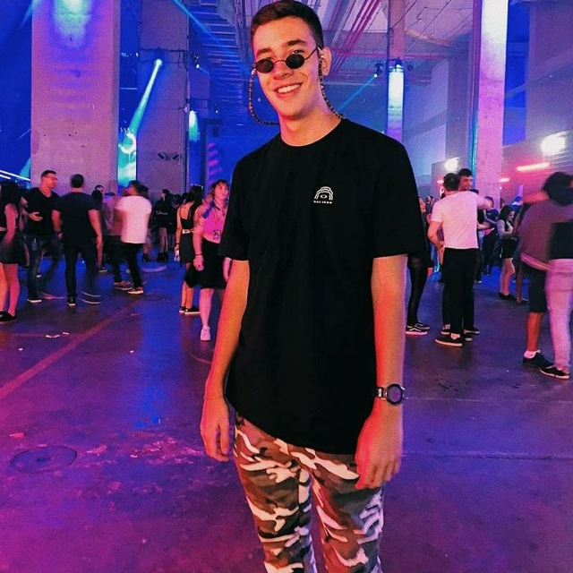

# Sobre

 

Repositório do grupo 06 - Portal da prefeitura de Londrina, repositorio criado para o desenvolvimento da documentação do projeto da disciplina de Interação Humano-Computador, ministrado pelo professor André Barros de Sales, na Universidade de Brasília - Gama (UnB-FGA), durante o período 2021/1.

O site escolhido foi o Portal da Prefeitura de Londrina, nesse site atualmente (2021) estão as noticías da cidade de Londrina, o planejamento para o combate da COVID-19, Portal de transparencia, Atividades e Projetos e outras funções.

## Integrantes
| Foto | Nome | Github | Email |
|:--:|:--:|:--:|:--:|
||Abner Filipe|@abner423|abner.f.c.r@hotmail.com|
||Davi Marinho|@DaviMarinho|davii_marinho@hotmail.com|
||Rafael Leão|@Rafaelltm|rafaelltm10@hotmail.com|
||Victor Souza|@vital14|limavictor49@gmail.com|
||Victor Yukio|@yukioz|yukio.link@gmail.com|
||Vitor Diniz |@vitordiniz25|vitordiniz25@gmail.com|
