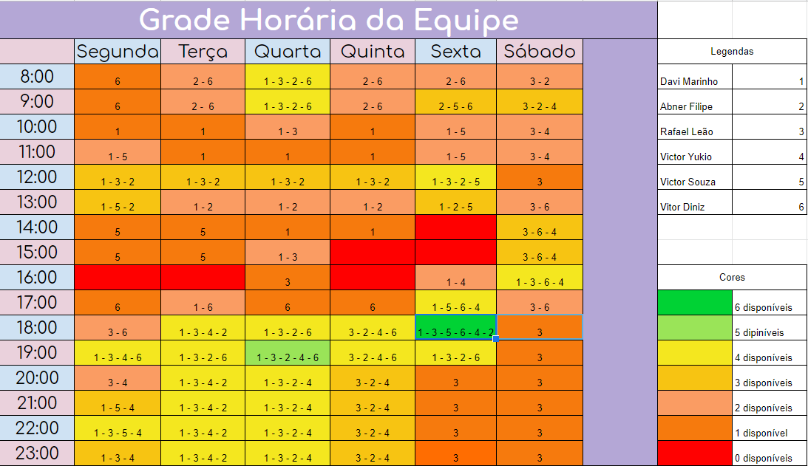
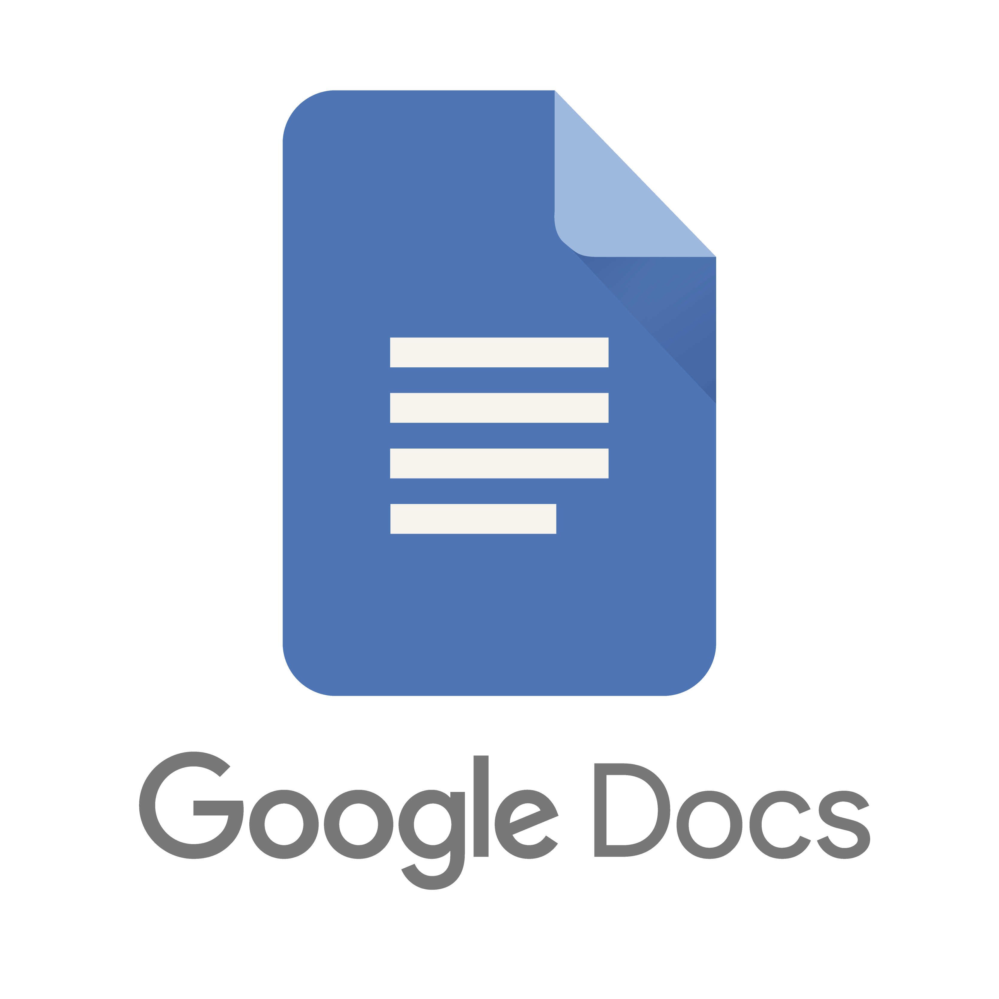

# Planejamento

## 1. Sites avaliados individualmente

- Abner Filipe - <a href="https://www.core-am.org.br/" target="_blank">Conselho Regional dos Representantes Comerciais no Estado do Amazonas</a>
- Davi Marinho - <a href="https://codeforces.com/" target="_blank">CodeForces</a>
- Rafael Leão - <a href="https://sig.unb.br/sigaa/verTelaLogin.do" target="_blank">SIGAA UnB</a>
- Victor Souza Dantas Martins Lima - <a href="http://www.detran.df.gov.br/" target="_blank">Detran-DF</a>
- Victor Yukio Cavalcanti Miki - <a href="http://www.nahora.df.gov.br/" target="_blank">Na hora DF</a>
- Vitor Diniz - <a href="https://portal.londrina.pr.gov.br/">Prefeitura de Londrina</a>

Em consenso, escolhemos o site da <a href="https://portal.londrina.pr.gov.br/">Prefeitura de Londrina</a> pois possui diversas interações quebradas e então teria bastante coisa para ser ajustada e avaliada.

O planejamento do site da Prefeitura de Londrina está hospedado <a href="https://unbbr-my.sharepoint.com/:b:/g/personal/190044403_aluno_unb_br/ERfVZxn_HSZBts2ulKFUJ3MBPIOzX1Do5tjisM5QcBOJvw?e=lms82L" target="_blank">aqui</a> e a avalição heurística está <a href="https://unbbr-my.sharepoint.com/:b:/g/personal/190044403_aluno_unb_br/EfQsqg0VRRtOq0w7xvMkrEYB83ybosljZjzeRHzb8BIo-g?e=eC4ds2" target="_blank">aqui</a>.

## 2. Cronograma

A partir dos prazos estipulados pela disciplina e pela disponibilidade dos integrantes, o grupo organizou um cronograma com o intuito de realizar as tarefas propostas no projeto.

OBS.: Essas datas podem mudar futuramente.

### 2.1 Cronograma de atividades

|                  Título                  | Data  |                                                                       Descrição                                                                       |
| :--------------------------------------: | :---: | :---------------------------------------------------------------------------------------------------------------------------------------------------: |
|         Planejamento do Projeto          | 16/08 |                                                     Planejamento do Projeto e Processo de Design                                                      |
|    Entrega da apresentação do projeto    | 28/08 |                                                   Perfil do usuário, Personas e Análise de tarefas                                                    |
|    Entrega da apresentação do projeto    | 04/09 |                           Princípios Gerais de Projeto, Metas de usabilidade, Guia de Estilo. (Fase: análise de requisitos)                           |
|    Entrega da apresentação do projeto    | 08/09 |                  Planejamento da Avaliação e planejamento do relato dos resultados da avaliação do Storyboard e Análise de tarefas.                   |
|    Entrega da apresentação do projeto    | 20/09 | Relato dos resultados do Story Board, Análise de tarefas e o Planejamento da Avaliação e do relato dos resultados da avaliação do Protótipo de Papel. |
|    Entrega da apresentação do projeto    | 02/10 |    Relato dos resultados do Protótipo de Papel e Planejamento daAvaliação e do relato dos resultados da avaliação do protótipo de alta fidelidade     |
|        Verificação dos artefatos.        | 04/10 |                                                   Verificação dos artefatos construídos no projeto                                                    |
| Entrega da apresentação do projeto final | 20/10 |         Resultados do Protótipo de Papel e Planejamento da Avaliação e o relato dos resultados da avaliação do protótipo de alta fidelidade.          |

<figcaption>Tabela 1 - Cronograma de atividades</figcaption>

### 2.2 Disponibilidade dos integrantes

Para deixar a disponibilidade dos integrantes de forma mais visual e interativa, montamos um quadro de horários, respeitando o tempo disponível de cada um dos integrantes.

 
  
  <figcaption>Figura 1 - Grade de disponibilidade dos integrantes</figcaption>

## 3. Metodologia adotada

Devido a comodidade dos integrantes, e experiências com projetos de outras disciplinas, iremos adotar o SCRUM como nossa metodologia de projeto.

### 3.1 SCRUM - Metodologia Ágil

Scrum é um framework de gerenciamento de projetos que divide o projeto em sprints, onde são definidas algumas issues a serem resolvidas em um prazo pré estipulado e dividindo a equipe em focos diferentes para que ao final da sprint todas as funcionalidades estejam prontas e o projeto caminhe de forma mais organizada.

### 3.2 Sprints

Como optamos pela metodologia SCRUM, técnica ágil em escala que oferece uma maneira de conectar várias equipes que precisam trabalhar juntas, iremos fazer sprints com duração de 1 semana, priorizando as entregas por meio do planning poker, facilitando assim os controles, divisões e revisões das tarefas.

### 3.3 Criação e disponibilidade das issues

Vamos listar todas as tarefas que temos que fazer durante a semana por meio da própria área de issues do github, e todas as tarefas deverão ter um critério de aceitação e revisões realizadas por outros integrantes do grupo.

### 3.4 Divisão de tarefas

A partir das reuniões, e após a realização do planning poker para determinarmos o grau de dificuldade de cada demanda, vamos dividir quais funções são específicas para cada membro e vamos listá-las nas nossas plataformas mais diretas, como Telegram, com a finalidade de fácil recuperação das informações das reuniões.

## 4. Ferramentas Utilizadas

| Ferramenta | Nome | Descrição |
| :--: | :--: | :--: |
|| Github | Ferramenta de versionamento de código|
||Discord|Ferramenta de Comunicação por voz e texto |
||Telegram|Ferramenta de Comunicação por texto |                  
||Microsoft Teams|Ferramenta de organização da disciplina  |
||Google Docs|Ferramenta de criação e compartilhamento de documentos|
||Canva|Ferramenta de design gráfico|
||Figma|Ferramenta de prototipação de projetos baseados em design web e mobile|
||LiveShare|Ferramenta de edição de código em time |
||VsCode|                        Editor de texto|
||Drawio|Ferramenta para criação de gráficos e artefatos|

<figcaption>Tabela 2 - Ferramentas utilizadas</figcaption>

## Referências bibliográficas:

> SIMONE DINIZ JUNQUEIRO BARBOSA, BRUNO SANTANA DA SILVA, Interação Humano-Computador, 1a . Edição, Editora Campus, 2010.

## Versionamento

| Versão | Data | Modificação | Autor |
| :--: | :--: | :--: | :--: |
| 1.0    | 11/08/2021 | Criação do projeto base | Abner Filipe, Victor Lima, Victor Yukio |
| 1.1    | 26/08/2021 |Ajuste de padrão de documento | Abner Filipe, Davi Marinho e Victor Lima |
